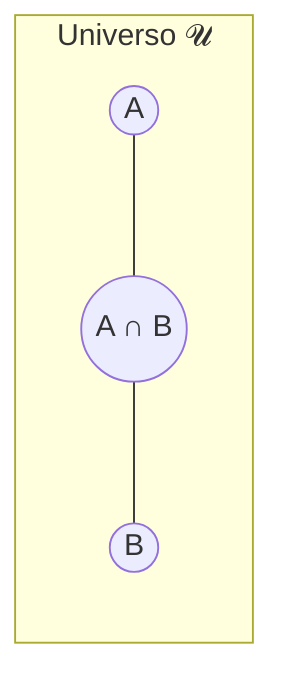

# 01. Conjuntos: fundamentos e operações

!!! info "Nesta aula"
    - O que é um conjunto e como descrevê-lo.
    - Pertinência, subconjunto, conjunto vazio e universo.
    - Operações: união, interseção, diferença e complemento.
    - Como tudo isso vira código em **Python**.

## 🧩 O que é um conjunto?

Um **conjunto** é uma coleção **não ordenada** de elementos **distintos**. Ele é
a peça de LEGO mais básica da matemática discreta: quase tudo — relações,
funções, grafos — é definido em cima de conjuntos.

Escrevemos conjuntos de duas formas:

=== "Por extensão"
    Listando os elementos:

    $$A = \{1, 2, 3, 4\}$$

=== "Por compreensão"
    Descrevendo uma **propriedade**:

    $$A = \{\, x \mid x \in \mathbb{N},\ 1 \le x \le 4 \,\}$$

    Lê-se: "o conjunto dos $x$ tais que $x$ é natural entre 1 e 4".

!!! note "Ordem e repetição não importam"
    $\{1, 2, 3\} = \{3, 1, 2\} = \{1, 1, 2, 3\}$. Um conjunto só registra
    **quais** elementos existem, não quantas vezes nem em que ordem.

## 🔑 Vocabulário essencial

| Símbolo | Significado | Exemplo |
| :--- | :--- | :--- |
| $\in$ | pertence a | $2 \in \{1,2,3\}$ |
| $\notin$ | não pertence a | $5 \notin \{1,2,3\}$ |
| $\subseteq$ | subconjunto de | $\{1,2\} \subseteq \{1,2,3\}$ |
| $\varnothing$ | conjunto vazio | $\{\,\}$ |
| $\mathcal{U}$ | conjunto universo | contexto do problema |
| $\lvert A \rvert$ | cardinalidade (nº de elementos) | $\lvert\{1,2,3\}\rvert = 3$ |

## ⚙️ Operações com conjuntos

Considere $A = \{1,2,3,4\}$ e $B = \{3,4,5,6\}$, com universo $\mathcal{U} = \{1,\dots,9\}$.

=== "União ∪"
    Tudo que está em $A$ **ou** em $B$: $A \cup B = \{1,2,3,4,5,6\}$.

=== "Interseção ∩"
    O que está em $A$ **e** em $B$: $A \cap B = \{3,4\}$.

=== "Diferença −"
    O que está em $A$ **mas não** em $B$: $A - B = \{1,2\}$.

=== "Complemento"
    O que **não** está em $A$ (dentro de $\mathcal{U}$):
    $\overline{A} = \{5,6,7,8,9\}$.

### Visualizando com diagramas de Venn



## 🐍 Conjuntos em Python

Python tem o tipo `set` nativo, e os operadores espelham a matemática:

```python
A = {1, 2, 3, 4}
B = {3, 4, 5, 6}
U = set(range(1, 10))  # {1, 2, ..., 9}

print(A | B)   # União        -> {1, 2, 3, 4, 5, 6}
print(A & B)   # Interseção   -> {3, 4}
print(A - B)   # Diferença    -> {1, 2}
print(U - A)   # Complemento  -> {5, 6, 7, 8, 9}

print(2 in A)          # Pertinência -> True
print({1, 2} <= A)     # Subconjunto -> True
print(len(A))          # Cardinalidade -> 4
```

!!! tip "Conjunto por compreensão em Python"
    A notação por compreensão da matemática tem par direto no código:

    ```python
    pares = {x for x in range(1, 11) if x % 2 == 0}
    print(pares)  # {2, 4, 6, 8, 10}
    ```

## 📐 Duas leis úteis

As **Leis de De Morgan** (que reveremos na lógica) já aparecem aqui:

$$\overline{A \cup B} = \overline{A} \cap \overline{B}
\qquad
\overline{A \cap B} = \overline{A} \cup \overline{B}$$

## 📝 Exercícios

??? abstract "Exercício 1 — Aquecimento"
    Dados $A = \{1,2,3,4,5\}$ e $B = \{2,4,6,8\}$, calcule à mão e depois
    confira em Python: $A \cup B$, $A \cap B$, $A - B$ e $B - A$.

??? abstract "Exercício 2 — Compreensão"
    Escreva por compreensão (em matemática **e** em Python) o conjunto dos
    múltiplos de 3 entre 1 e 30.

??? abstract "Exercício 3 — De Morgan na prática"
    Com $\mathcal{U} = \{1,\dots,10\}$, $A=\{1,2,3,4\}$ e $B=\{3,4,5,6\}$,
    verifique em Python que $\overline{A \cup B} = \overline{A} \cap \overline{B}$.

??? abstract "Exercício 4 — Desafio"
    Escreva uma função `simetrica(A, B)` que devolva a **diferença simétrica**
    (elementos que estão em exatamente um dos conjuntos) **sem** usar o operador
    `^`. Compare seu resultado com `A ^ B`.

!!! tip "Próxima Parada 🚏"
    Hora de praticar! Resolva a **[Lista 01 — Conjuntos](../listas/01-lista.md)**
    e entregue no Google Classroom. Na próxima aula veremos **[Relações](02-aula.md)**,
    que nascem justamente de conjuntos.
