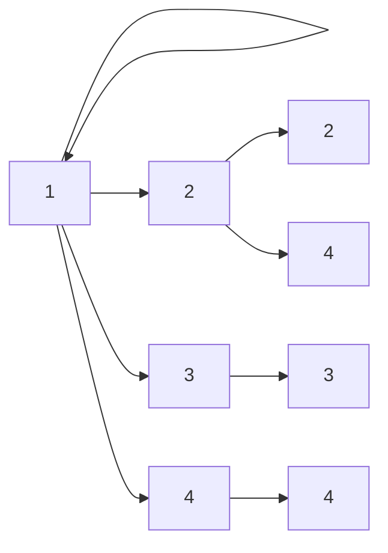

# 02. Relações

!!! info "Nesta aula"
    - Produto cartesiano como base das relações.
    - O que é uma relação binária.
    - Propriedades: reflexiva, simétrica, transitiva.
    - Relações de equivalência e de ordem.

## ✖️ Produto cartesiano

Antes de "relacionar" elementos, precisamos de **pares ordenados**. O
**produto cartesiano** $A \times B$ é o conjunto de todos os pares $(a, b)$ com
$a \in A$ e $b \in B$:

$$A \times B = \{\, (a,b) \mid a \in A,\ b \in B \,\}$$

Se $A = \{1,2\}$ e $B = \{x, y\}$:

$$A \times B = \{(1,x), (1,y), (2,x), (2,y)\}$$

!!! note "Aqui a ordem importa!"
    Diferente de conjuntos, em pares **ordenados** $(1, x) \neq (x, 1)$. E
    $\lvert A \times B \rvert = \lvert A \rvert \cdot \lvert B \rvert$.

## 🔗 O que é uma relação

Uma **relação binária** $R$ de $A$ em $B$ é simplesmente **um subconjunto** de
$A \times B$. Escrevemos $a\,R\,b$ quando $(a,b) \in R$.

**Exemplo:** em $A = \{1,2,3,4\}$, a relação "divide" ($a \mid b$):

$$R = \{(1,1),(1,2),(1,3),(1,4),(2,2),(2,4),(3,3),(4,4)\}$$



## 🧭 Propriedades de relações em um conjunto

Quando $R \subseteq A \times A$ (relação **em** $A$), analisamos três propriedades-chave:

=== "Reflexiva"
    Todo elemento se relaciona consigo mesmo:
    $$\forall a \in A,\ (a,a) \in R$$
    Ex.: "é igual a", "divide".

=== "Simétrica"
    Se $a$ se relaciona com $b$, então $b$ com $a$:
    $$\forall a,b,\ (a,b) \in R \Rightarrow (b,a) \in R$$
    Ex.: "é irmão de", "tem a mesma idade que".

=== "Transitiva"
    Encadeamento:
    $$(a,b) \in R \wedge (b,c) \in R \Rightarrow (a,c) \in R$$
    Ex.: "é menor que", "é ancestral de".

=== "Antissimétrica"
    Se vale nos **dois sentidos**, os elementos são iguais:
    $$(a,b) \in R \wedge (b,a) \in R \Rightarrow a = b$$
    Ex.: "$\le$", "divide", "$\subseteq$". É o que impede "empates" e permite
    **ordenar** os elementos.

!!! warning "Antissimétrica não é 'o contrário de simétrica'"
    Uma relação pode ser as duas coisas (ex.: a igualdade), nenhuma, ou só uma.
    Antissimétrica proíbe pares $(a,b)$ e $(b,a)$ **com $a \neq b$** ao mesmo tempo.

## 🏷️ Dois tipos especiais

| Tipo | Reflexiva | Simétrica | Antissimétrica | Transitiva |
| :--- | :---: | :---: | :---: | :---: |
| **Equivalência** | ✅ | ✅ | — | ✅ |
| **Ordem parcial** | ✅ | — | ✅ | ✅ |

- **Relação de equivalência** particiona o conjunto em *classes* (ex.: "mesmo
  resto na divisão por 3").
- **Relação de ordem** organiza os elementos (ex.: $\le$, "divide").

### Classes de equivalência e partição

Se $R$ é de equivalência sobre $A$, a **classe** de um elemento $a$ é
$[a] = \{\, x \in A \mid x\,R\,a \,\}$. Duas propriedades importantes:

- toda classe é **não vazia** (pelo menos $a \in [a]$, pela reflexividade);
- duas classes ou são **iguais** ou são **disjuntas** — nunca se sobrepõem "pela metade".

Assim, as classes formam uma **partição** de $A$: fatiam o conjunto em blocos que
cobrem tudo sem sobra nem repetição.

!!! example "Mesmo resto na divisão por 3 (sobre $\{0,1,\dots,8\}$)"
    Agrupando pelo resto da divisão por 3:

    - $[0] = \{0, 3, 6\}$  (resto 0)
    - $[1] = \{1, 4, 7\}$  (resto 1)
    - $[2] = \{2, 5, 8\}$  (resto 2)

    As três classes cobrem todo o conjunto e não se cruzam → é uma partição, e a
    relação é de equivalência.

## 🐍 Relações em Python

Representamos uma relação como um **conjunto de tuplas** e testamos suas propriedades:

```python
def reflexiva(R, A):
    return all((a, a) in R for a in A)

def simetrica(R):
    return all((b, a) in R for (a, b) in R)

def transitiva(R):
    return all((a, c) in R
               for (a, b) in R
               for (x, c) in R if b == x)

def antissimetrica(R):
    return all(a == b for (a, b) in R if (b, a) in R)

def eh_equivalencia(R, A):
    return reflexiva(R, A) and simetrica(R) and transitiva(R)

def eh_ordem_parcial(R, A):
    return reflexiva(R, A) and antissimetrica(R) and transitiva(R)

A = {1, 2, 3}
R = {(1, 1), (2, 2), (3, 3), (1, 2), (2, 1)}

print(reflexiva(R, A))       # True
print(simetrica(R))          # True
print(transitiva(R))         # True
print(eh_equivalencia(R, A)) # True  -> é relação de equivalência
```

!!! tip "Produto cartesiano em Python"
    ```python
    from itertools import product
    A, B = {1, 2}, {"x", "y"}
    print(set(product(A, B)))
    # {(1, 'x'), (1, 'y'), (2, 'x'), (2, 'y')}
    ```

## 📝 Exercícios

??? abstract "Exercício 1"
    Liste $A \times B$ para $A = \{a,b,c\}$ e $B = \{0,1\}$. Quantos pares há?

??? abstract "Exercício 2"
    A relação "$a$ e $b$ têm o mesmo resto na divisão por 3" sobre
    $\{0,1,\dots,8\}$ é de equivalência? Liste suas classes.

??? abstract "Exercício 3"
    Classifique a relação $\le$ sobre $\{1,2,3,4\}$: quais das três propriedades
    ela satisfaz? É ordem ou equivalência?

??? abstract "Exercício 4 — Desafio"
    Implemente `eh_equivalencia(R, A)` reutilizando as funções da aula e teste
    com pelo menos um exemplo verdadeiro e um falso.

## 📚 Referências

**Livros (teoria)**

- ROSEN, K. H. *Matemática Discreta e suas Aplicações*. 7. ed. AMGH/McGraw-Hill —
  cap. **Relações** (propriedades, relações de equivalência e de ordem).
- GERSTING, J. L. *Fundamentos Matemáticos para a Ciência da Computação*. 7. ed.
  LTC — cap. **Relações, Funções e Matrizes**.
- MENEZES, P. B. *Matemática Discreta para Computação e Informática*. 4. ed.
  Bookman — cap. **Relações**.
- SCHEINERMAN, E. R. *Matemática Discreta: uma introdução*. Cengage — seções sobre
  **relações e partições**.

**Documentação e prática (Python)**

- Python — `itertools.product` (produto cartesiano): <https://docs.python.org/3/library/itertools.html#itertools.product>
- Python — tuplas e conjuntos: <https://docs.python.org/3/tutorial/datastructures.html>

!!! tip "Próxima Parada 🚏"
    Pratique na **[Lista 02 — Relações](../listas/02-lista.md)**. Em seguida,
    veremos um tipo *muito* especial de relação: as **[Funções](03-aula.md)**.
