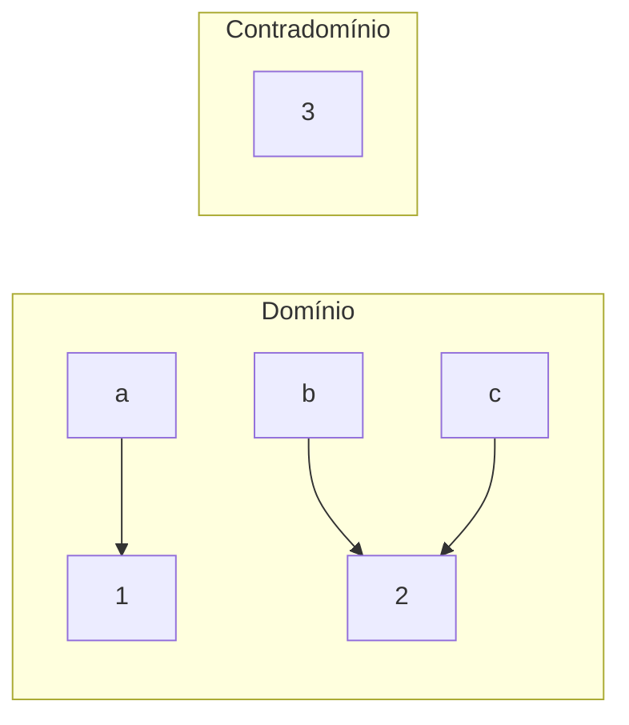

# 03. Funções

!!! info "Nesta aula"
    - Função como relação especial: domínio, contradomínio e imagem.
    - Injetora, sobrejetora e bijetora.
    - Composição e função inversa.
    - Conexão com funções em Python.

## 🎯 O que é uma função

Uma **função** $f: A \to B$ é uma relação que associa **cada** elemento de $A$
a **exatamente um** elemento de $B$.

$$\forall a \in A,\ \exists!\, b \in B \ \text{tal que}\ f(a) = b$$

- $A$ = **domínio** (todas as entradas).
- $B$ = **contradomínio** (saídas possíveis).
- **Imagem** = saídas realmente atingidas: $\{ f(a) \mid a \in A \}$.

!!! warning "Relação vs. função"
    Toda função é relação, mas nem toda relação é função. Falha se um elemento
    do domínio tiver **zero** ou **mais de uma** saída.



Acima, `3` está no contradomínio mas **não** na imagem.

## 🔍 Classificando funções

=== "Injetora (1-a-1)"
    Entradas diferentes → saídas diferentes.
    $$f(a_1) = f(a_2) \Rightarrow a_1 = a_2$$

=== "Sobrejetora"
    A imagem cobre **todo** o contradomínio.
    $$\forall b \in B,\ \exists a \in A:\ f(a) = b$$

=== "Bijetora"
    **Injetora e sobrejetora** ao mesmo tempo. Só bijeções têm **inversa**.

| Tipo | Regra | Tem inversa? |
| :--- | :--- | :---: |
| Injetora | não repete saídas | não (necessariamente) |
| Sobrejetora | cobre o contradomínio | não (necessariamente) |
| Bijetora | ambas | ✅ sim |

!!! example "Reconhecendo cada tipo"
    Considere funções de $A = \{0,1,2,3\}$:

    - $f(x) = 2x$ com contradomínio $\{0,1,\dots,6\}$ → **injetora** (saídas
      $0,2,4,6$ não se repetem) mas **não sobrejetora** ($1,3,5$ não são atingidos).
    - $g(x) = x \bmod 2$ com contradomínio $\{0,1\}$ → **sobrejetora** (atinge $0$ e
      $1$) mas **não injetora** ($g(0)=g(2)$).
    - $h(x) = x$ com contradomínio $\{0,1,2,3\}$ → **bijetora**.

!!! tip "Teste rápido em domínio finito"
    - Injetora: nº de saídas distintas $=$ nº de entradas.
    - Sobrejetora: conjunto de saídas $=$ contradomínio.
    - Bijetora: as duas ao mesmo tempo (⇒ $\lvert A \rvert = \lvert B \rvert$).

## 🔁 Composição

A composição $g \circ f$ aplica $f$ e depois $g$:

$$(g \circ f)(x) = g\big(f(x)\big)$$

Se $f(x) = x + 1$ e $g(x) = x^2$, então $(g \circ f)(3) = g(4) = 16$.

!!! warning "A composição não é comutativa"
    Em geral $g \circ f \neq f \circ g$. Com $f(x)=x+2$ e $g(x)=3x$:
    $$(g \circ f)(x) = 3(x+2) = 3x + 6 \qquad (f \circ g)(x) = 3x + 2$$
    Ordem importa: primeiro aplica-se a função **de dentro**.

## ↩️ Função inversa

Se $f: A \to B$ é **bijetora**, existe uma única **função inversa**
$f^{-1}: B \to A$ que "desfaz" $f$:

$$f^{-1}(b) = a \iff f(a) = b, \qquad (f^{-1} \circ f)(x) = x$$

Só bijeções têm inversa: se $f$ **não** for injetora, um mesmo $b$ viria de duas
entradas (a inversa não saberia qual escolher); se não for sobrejetora, algum $b$
não teria origem.

!!! example "Achando a inversa"
    Para $f(x) = 3x + 2$, troque $y = 3x + 2$ e isole $x$:
    $$x = \frac{y - 2}{3} \ \Rightarrow\ f^{-1}(y) = \frac{y-2}{3}$$
    Confira: $f^{-1}(f(1)) = f^{-1}(5) = 1$. ✅

## 🐍 Funções em Python

O conceito matemático e o `def` do Python são quase o mesmo:

```python
def f(x):          # f: Z -> Z, f(x) = x + 1
    return x + 1

def g(x):          # g(x) = x^2
    return x ** 2

# Composição g ∘ f
def composta(x):
    return g(f(x))

print(composta(3))  # 16
```

!!! tip "Verificando injetividade e sobrejetividade num domínio finito"
    ```python
    def eh_injetora(f, dominio):
        saidas = [f(x) for x in dominio]
        return len(saidas) == len(set(saidas))

    def eh_sobrejetora(f, dominio, contradominio):
        return set(f(x) for x in dominio) == set(contradominio)

    print(eh_injetora(lambda x: 2 * x, range(5)))            # True
    print(eh_injetora(lambda x: x % 3, range(9)))            # False
    print(eh_sobrejetora(lambda x: x % 2, range(4), {0, 1})) # True
    ```

## 🧮 Por que isso importa na Computação?

- **Funções hash** mapeiam chaves em índices (idealmente quase injetoras).
- **Funções bijetoras** garantem que dá para "desfazer" (criptografia, codecs).
- **Composição** é a base de *pipelines* de dados e programação funcional.

## 📝 Exercícios

??? abstract "Exercício 1"
    Para $f(x) = 2x$ sobre $\{0,1,2,3\}$ com contradomínio $\{0,1,\dots,6\}$:
    qual é a imagem? É injetora? É sobrejetora?

??? abstract "Exercício 2"
    Dê um exemplo de função **sobrejetora mas não injetora** e outro
    **injetora mas não sobrejetora**.

??? abstract "Exercício 3"
    Com $f(x)=x+2$ e $g(x)=3x$, calcule $(g \circ f)(x)$ e $(f \circ g)(x)$.
    Elas são iguais?

??? abstract "Exercício 4 — Desafio"
    Escreva `eh_bijetora(f, dominio, contradominio)` que devolva `True` só
    quando $f$ for injetora **e** sobrejetora sobre os conjuntos dados.
    (Reutilize `eh_injetora` e `eh_sobrejetora` da aula.)

## 📚 Referências

**Livros (teoria)**

- ROSEN, K. H. *Matemática Discreta e suas Aplicações*. 7. ed. AMGH/McGraw-Hill —
  cap. **Funções** (domínio, imagem, injeção/sobrejeção, composição e inversa).
- GERSTING, J. L. *Fundamentos Matemáticos para a Ciência da Computação*. 7. ed.
  LTC — cap. **Relações, Funções e Matrizes**.
- SCHEINERMAN, E. R. *Matemática Discreta: uma introdução*. Cengage — seção sobre
  **funções**.
- LIPSCHUTZ, S.; LIPSON, M. *Matemática Discreta* (Schaum). Bookman — cap. **Funções**.

**Documentação e prática (Python)**

- Python — funções (`def`) e `lambda`: <https://docs.python.org/3/tutorial/controlflow.html#defining-functions>
- Python — expressões `lambda`: <https://docs.python.org/3/reference/expressions.html#lambda>

!!! tip "Próxima Parada 🚏"
    Aplique na **[Lista 03 — Funções](../listas/03-lista.md)**. Depois mudamos de
    terreno para a **[Lógica proposicional](04-aula.md)**.
