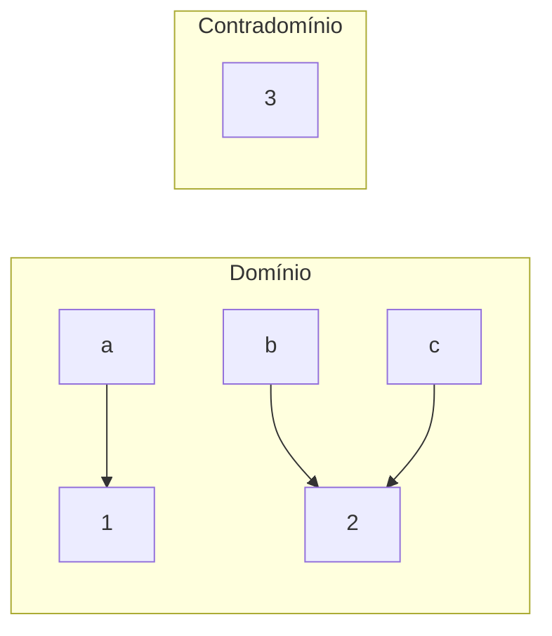

# 03. Funções

!!! info "Nesta aula"
    - Função como relação especial: domínio, contradomínio e imagem.
    - Injetora, sobrejetora e bijetora.
    - Composição e função inversa.
    - Conexão com funções em Python.

## 🎯 O que é uma função

Uma **função** $f: A \to B$ é uma relação que associa **cada** elemento de $A$
a **exatamente um** elemento de $B$.

$$\forall a \in A,\ \exists!\, b \in B \ \text{tal que}\ f(a) = b$$

- $A$ = **domínio** (todas as entradas).
- $B$ = **contradomínio** (saídas possíveis).
- **Imagem** = saídas realmente atingidas: $\{ f(a) \mid a \in A \}$.

!!! warning "Relação vs. função"
    Toda função é relação, mas nem toda relação é função. Falha se um elemento
    do domínio tiver **zero** ou **mais de uma** saída.



Acima, `3` está no contradomínio mas **não** na imagem.

## 🔍 Classificando funções

=== "Injetora (1-a-1)"
    Entradas diferentes → saídas diferentes.
    $$f(a_1) = f(a_2) \Rightarrow a_1 = a_2$$

=== "Sobrejetora"
    A imagem cobre **todo** o contradomínio.
    $$\forall b \in B,\ \exists a \in A:\ f(a) = b$$

=== "Bijetora"
    **Injetora e sobrejetora** ao mesmo tempo. Só bijeções têm **inversa**.

| Tipo | Regra | Tem inversa? |
| :--- | :--- | :---: |
| Injetora | não repete saídas | não (necessariamente) |
| Sobrejetora | cobre o contradomínio | não (necessariamente) |
| Bijetora | ambas | ✅ sim |

## 🔁 Composição

A composição $g \circ f$ aplica $f$ e depois $g$:

$$(g \circ f)(x) = g\big(f(x)\big)$$

Se $f(x) = x + 1$ e $g(x) = x^2$, então $(g \circ f)(3) = g(4) = 16$.

## 🐍 Funções em Python

O conceito matemático e o `def` do Python são quase o mesmo:

```python
def f(x):          # f: Z -> Z, f(x) = x + 1
    return x + 1

def g(x):          # g(x) = x^2
    return x ** 2

# Composição g ∘ f
def composta(x):
    return g(f(x))

print(composta(3))  # 16
```

!!! tip "Verificando injetividade sobre um domínio finito"
    ```python
    def eh_injetora(f, dominio):
        saidas = [f(x) for x in dominio]
        return len(saidas) == len(set(saidas))

    print(eh_injetora(lambda x: 2 * x, range(5)))   # True
    print(eh_injetora(lambda x: x % 3, range(9)))    # False
    ```

## 🧮 Por que isso importa na Computação?

- **Funções hash** mapeiam chaves em índices (idealmente quase injetoras).
- **Funções bijetoras** garantem que dá para "desfazer" (criptografia, codecs).
- **Composição** é a base de *pipelines* de dados e programação funcional.

## 📝 Exercícios

??? abstract "Exercício 1"
    Para $f(x) = 2x$ sobre $\{0,1,2,3\}$ com contradomínio $\{0,1,\dots,6\}$:
    qual é a imagem? É injetora? É sobrejetora?

??? abstract "Exercício 2"
    Dê um exemplo de função **sobrejetora mas não injetora** e outro
    **injetora mas não sobrejetora**.

??? abstract "Exercício 3"
    Com $f(x)=x+2$ e $g(x)=3x$, calcule $(g \circ f)(x)$ e $(f \circ g)(x)$.
    Elas são iguais?

??? abstract "Exercício 4 — Desafio"
    Escreva `eh_bijetora(f, dominio, contradominio)` que devolva `True` só
    quando $f$ for injetora **e** sobrejetora sobre os conjuntos dados.

!!! tip "Próxima Parada 🚏"
    Aplique na **[Lista 03 — Funções](../listas/03-lista.md)**. Depois mudamos de
    terreno para a **[Lógica proposicional](04-aula.md)**.
