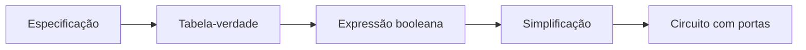
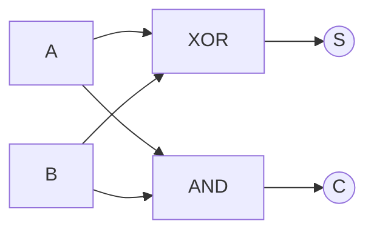
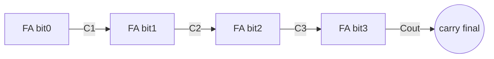

# 07. Circuitos digitais e aplicações

!!! info "Nesta aula"
    - Portas lógicas e seus símbolos.
    - Da tabela-verdade ao circuito.
    - Somador de 1 bit (half adder e full adder).
    - Por que álgebra booleana = hardware.

## 🔌 Portas lógicas

Cada operação booleana vira uma **porta** física:

| Porta | Símbolo | Função |
| :--- | :--- | :--- |
| AND | ∧ | 1 só se **todas** entradas = 1 |
| OR | ∨ | 1 se **alguma** entrada = 1 |
| NOT | ¬ | inverte |
| NAND | ⊼ | NOT(AND) |
| NOR | ⊽ | NOT(OR) |
| XOR | ⊕ | 1 se entradas **diferentes** |

!!! note "NAND é universal"
    Qualquer circuito pode ser construído **só com portas NAND** (ou só NOR).
    Isso simplifica a fabricação de chips.

### Por que NAND é universal

Se conseguimos montar NOT, AND e OR usando **apenas** NAND, então montamos
qualquer função booleana. Escrevendo $\text{NAND}(x,y) = \overline{x \cdot y}$:

| Porta | Construção com NAND | Ideia |
| :--- | :--- | :--- |
| NOT | $\overline{x} = \text{NAND}(x, x)$ | $\overline{x \cdot x} = \overline{x}$ |
| AND | $x \cdot y = \text{NAND}(\text{NAND}(x,y),\ \text{NAND}(x,y))$ | NAND seguido de NOT |
| OR | $x + y = \text{NAND}(\overline{x}, \overline{y})$ | De Morgan: $\overline{\overline{x}\cdot\overline{y}} = x+y$ |

O mesmo vale para NOR. Por isso essas duas portas são chamadas de **portas
universais**.

## 🛠️ Da lógica ao circuito

Um circuito combinacional implementa uma **função booleana**. Fluxo de projeto:



## ➕ Meio somador (Half Adder)

Soma dois bits $A$ e $B$, produzindo a soma $S$ e o "vai-um" (carry) $C$:

| $A$ | $B$ | $S$ | $C$ |
| :-: | :-: | :-: | :-: |
| 0 | 0 | 0 | 0 |
| 0 | 1 | 1 | 0 |
| 1 | 0 | 1 | 0 |
| 1 | 1 | 0 | 1 |

Das colunas saem as expressões:

$$S = A \oplus B \qquad C = A \cdot B$$



## ➕➕ Somador completo (Full Adder)

Agora com um carry de entrada $C_{in}$:

$$S = A \oplus B \oplus C_{in}
\qquad
C_{out} = AB + C_{in}(A \oplus B)$$

Encadeando full adders, construímos somadores de $n$ bits — a base da **ULA**
(unidade lógica e aritmética) de qualquer processador.

### Somador com propagação de "vai-um" (ripple carry)

Para somar dois números de $n$ bits, ligamos $n$ full adders em cadeia: o
$C_{out}$ de cada estágio vira o $C_{in}$ do próximo. O bit mais baixo (LSB) usa
um $C_{in} = 0$.



!!! example "Somando 0110₂ + 0101₂"
    $0110_2 = 6$ e $0101_2 = 5$. Bit a bit (do LSB para o MSB), o carry vai
    "subindo" e o resultado é $1011_2 = 11$, com carry final $0$. Se o carry final
    fosse $1$, indicaria **overflow** para 4 bits.

## 🐍 Simulando circuitos em Python

```python
def half_adder(a, b):
    soma  = a ^ b        # XOR
    carry = a & b        # AND
    return soma, carry

def full_adder(a, b, c_in):
    s1, c1 = half_adder(a, b)
    s,  c2 = half_adder(s1, c_in)
    return s, c1 | c2

for a in (0, 1):
    for b in (0, 1):
        print(a, b, "->", half_adder(a, b))
```

!!! tip "Somador de 4 bits encadeando full adders"
    ```python
    def soma_4bits(A, B):   # A, B: listas de 4 bits (LSB primeiro)
        carry, resultado = 0, []
        for a, b in zip(A, B):
            s, carry = full_adder(a, b, carry)
            resultado.append(s)
        return resultado, carry
    ```

## 🌍 Aplicações

- **ULA/CPU:** somadores, comparadores e multiplexadores são circuitos booleanos.
- **Memórias e registradores:** portas realimentadas guardam bits.
- **Controle:** decodificadores traduzem instruções em sinais.

## 📝 Exercícios

??? abstract "Exercício 1"
    Desenhe (ou descreva) o circuito de $f = \overline{A} \cdot B + A \cdot \overline{B}$.
    Que porta única equivale a ele?

??? abstract "Exercício 2"
    Monte a tabela-verdade do **full adder** e confira contra a função Python.

??? abstract "Exercício 3"
    Mostre que NAND é universal: implemente NOT, AND e OR usando **apenas** NAND.

??? abstract "Exercício 4 — Desafio"
    Use `soma_4bits` para somar $0110_2$ e $0101_2$. Confira o resultado em decimal
    e explique o carry final.

## 📚 Referências

**Livros (teoria)**

- TOCCI, R. J.; WIDMER, N. S.; MOSS, G. L. *Sistemas Digitais: princípios e
  aplicações*. Pearson — **portas lógicas, somadores e circuitos combinacionais**.
- IDOETA, I. V.; CAPUANO, F. G. *Elementos de Eletrônica Digital*. Érica — cap.
  **Circuitos combinacionais** (meio somador e somador completo).
- ROSEN, K. H. *Matemática Discreta e suas Aplicações*. 7. ed. AMGH/McGraw-Hill —
  cap. **Álgebra Booleana** (portas e projeto de circuitos).
- NISAN, N.; SCHOCKEN, S. *The Elements of Computing Systems* (projeto Nand2Tetris)
  — construindo um computador **a partir de portas NAND**: <https://www.nand2tetris.org/>

**Documentação e prática (Python)**

- Python — operadores bit a bit (`^`, `&`, `|`): <https://docs.python.org/3/reference/expressions.html#binary-bitwise-operations>
- Python — `zip` (encadear listas de bits): <https://docs.python.org/3/library/functions.html#zip>

!!! tip "Próxima Parada 🚏"
    Vá para a **[Lista 07 — Circuitos digitais](../listas/07-lista.md)**. Trocamos
    de assunto para **contar** possibilidades em
    **[Princípios de contagem](08-aula.md)**.
