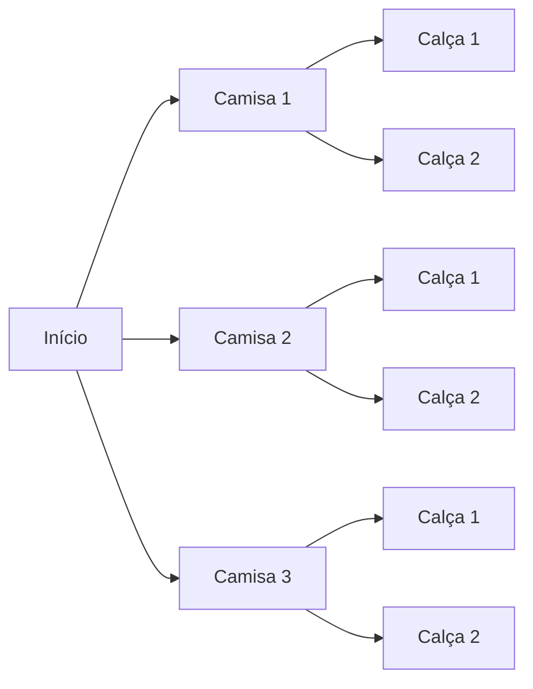

# 08. Princípios de contagem

!!! info "Nesta aula"
    - Princípio aditivo e multiplicativo.
    - Princípio da inclusão-exclusão.
    - Princípio da casa dos pombos.
    - Contando na análise de algoritmos.

## ➕ Princípio aditivo

Se uma tarefa pode ser feita de $m$ maneiras **OU** de $n$ maneiras (opções
**disjuntas**), então há $m + n$ maneiras no total.

> Um menu tem 3 sucos **ou** 2 refrigerantes → $3 + 2 = 5$ bebidas.

## ✖️ Princípio multiplicativo

Se uma tarefa tem uma etapa com $m$ opções **E** outra com $n$ opções, há
$m \cdot n$ maneiras de fazer as duas.

> 3 camisas **e** 2 calças → $3 \cdot 2 = 6$ combinações de roupa.



!!! tip "Como escolher a regra"
    - "**OU**", etapas independentes → **some**.
    - "**E**", etapas em sequência → **multiplique**.

## 🔗 Inclusão-Exclusão

Quando os conjuntos **se sobrepõem**, somar duplicaria a interseção:

$$\lvert A \cup B \rvert = \lvert A \rvert + \lvert B \rvert - \lvert A \cap B \rvert$$

> Numa turma, 18 gostam de Python, 15 de Java e 7 dos dois. Quantos gostam de
> pelo menos uma? $18 + 15 - 7 = 26$.

Para três conjuntos:

$$\lvert A \cup B \cup C \rvert = \lvert A\rvert+\lvert B\rvert+\lvert C\rvert
- \lvert A\cap B\rvert - \lvert A\cap C\rvert - \lvert B\cap C\rvert
+ \lvert A\cap B\cap C\rvert$$

!!! note "\"Pelo menos um\" vs. \"exatamente um\""
    - **Pelo menos um** dos dois → $\lvert A \cup B \rvert$.
    - **Exatamente um** (num só dos dois) → tira a interseção **duas vezes**:
      $$\lvert A \rvert + \lvert B \rvert - 2\lvert A \cap B \rvert$$
    - **Só em $A$** (em $A$ e não em $B$) → $\lvert A \rvert - \lvert A \cap B \rvert$.

!!! example "Estágio e monitoria"
    Numa turma, 20 fazem estágio ($A$), 12 são monitores ($B$) e 5 fazem os dois:

    - Pelo menos uma: $20 + 12 - 5 = 27$.
    - Exatamente uma: $20 + 12 - 2\cdot 5 = 22$.
    - Só estágio: $20 - 5 = 15$; só monitoria: $12 - 5 = 7$ (e $15 + 7 = 22$ ✅).

## 🕳️ Casa dos pombos (Pigeonhole)

!!! note "Princípio da casa dos pombos"
    Se colocamos $n$ pombos em $k$ casas e $n > k$, então **alguma casa tem
    pelo menos 2 pombos**.

> Em 13 pessoas, pelo menos duas nascem no mesmo mês (13 pombos, 12 casas).

Versão geral: alguma casa tem pelo menos $\lceil n/k \rceil$ pombos.

!!! tip "Como aplicar"
    Identifique quem são os **pombos** (os objetos) e quais são as **casas** (as
    categorias). Se há mais pombos que casas, a colisão é inevitável. Ex.: 8
    pessoas (pombos) e 7 dias da semana (casas) → pelo menos duas fazem aniversário
    no mesmo dia da semana.

## 🐍 Contando em Python

```python
from itertools import product

# Princípio multiplicativo: senhas de 2 letras + 1 dígito
letras = "abc"
digitos = "01"
combos = list(product(letras, letras, digitos))
print(len(combos))   # 3 * 3 * 2 = 18

# Inclusão-exclusão com conjuntos reais
python_fans = {1, 2, 3, 4, 5}
java_fans   = {4, 5, 6, 7}
pelo_menos_um = len(python_fans | java_fans)
por_inc_exc   = len(python_fans) + len(java_fans) - len(python_fans & java_fans)
print(pelo_menos_um, por_inc_exc)   # 7 7
```

## 🌍 Por que isso importa

- **Análise de algoritmos:** contar operações estima a complexidade.
- **Espaço de busca:** quantas configurações um solver precisa explorar.
- **Probabilidade:** contagem é o denominador de quase toda probabilidade.

## 📝 Exercícios

??? abstract "Exercício 1"
    Quantas placas no formato **3 letras + 4 dígitos** existem (letras de A–Z)?

??? abstract "Exercício 2"
    Numa turma, 20 fazem estágio, 12 são monitores e 5 fazem os dois. Quantos
    fazem pelo menos uma atividade? E exatamente uma?

??? abstract "Exercício 3"
    Mostre, pela casa dos pombos, que em qualquer grupo de 8 pessoas pelo menos
    duas fazem aniversário no mesmo dia da semana.

??? abstract "Exercício 4 — Desafio"
    Escreva `conta_senhas(tam, alfabeto)` que devolva o número de senhas de dado
    tamanho e confirme contra `len(list(product(...)))` para casos pequenos.

## 📚 Referências

**Livros (teoria)**

- ROSEN, K. H. *Matemática Discreta e suas Aplicações*. 7. ed. AMGH/McGraw-Hill —
  cap. **Contagem** (regras da soma/produto, inclusão-exclusão, casa dos pombos).
- MORGADO, A. C. et al. *Análise Combinatória e Probabilidade*. SBM (Coleção do
  Professor de Matemática) — **princípios de contagem**.
- SANTOS, J. P. O.; MELLO, M. P.; MURARI, I. T. C. *Introdução à Análise
  Combinatória*. Ciência Moderna — fundamentos de **contagem**.
- GERSTING, J. L. *Fundamentos Matemáticos para a Ciência da Computação*. 7. ed.
  LTC — cap. **Conjuntos e Combinatória**.

**Documentação e prática (Python)**

- Python — `itertools.product`: <https://docs.python.org/3/library/itertools.html#itertools.product>
- Python — `math.ceil` (casa dos pombos): <https://docs.python.org/3/library/math.html#math.ceil>

!!! tip "Próxima Parada 🚏"
    Resolva a **[Lista 08 — Contagem](../listas/08-lista.md)**. A seguir refinamos
    a contagem com **[Combinatória](09-aula.md)** (permutações e combinações).
