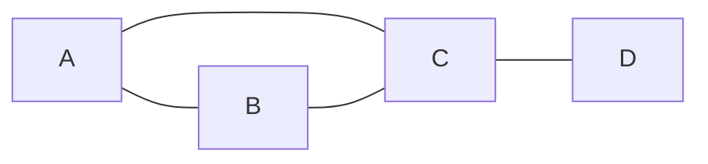
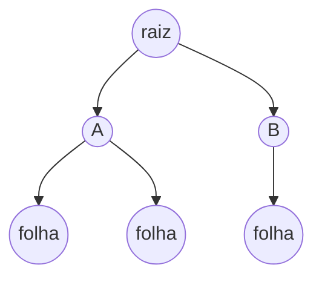

# 11. Grafos e árvores

!!! info "Nesta aula"
    - Vértices, arestas e tipos de grafo.
    - Representações: lista e matriz de adjacência.
    - Grau, caminho e ciclo.
    - Árvores como grafos especiais.

## 🕸️ O que é um grafo

Um **grafo** $G = (V, E)$ é um conjunto de **vértices** $V$ e um conjunto de
**arestas** $E$ (pares de vértices) que os conectam. É a estrutura ideal para
modelar **relações**: redes sociais, mapas, dependências.



=== "Não dirigido"
    Arestas sem direção: se $A$–$B$, então $B$–$A$. (amizades)

=== "Dirigido (dígrafo)"
    Arestas com seta: $A \to B$ não implica $B \to A$. (seguidores, links)

=== "Ponderado"
    Arestas têm **peso** (custo/distância). (mapas rodoviários)

## 🔢 Conceitos-chave

| Termo | Significado |
| :--- | :--- |
| **Grau** de $v$ | nº de arestas incidentes em $v$ |
| **Caminho** | sequência de vértices ligados por arestas |
| **Ciclo** | caminho que começa e termina no mesmo vértice |
| **Conexo** | existe caminho entre quaisquer dois vértices |

!!! note "Handshake Lemma"
    A soma dos graus de todos os vértices é o **dobro** do número de arestas:
    $\sum_{v \in V} \deg(v) = 2\lvert E \rvert$.

## 🗂️ Como representar um grafo

=== "Lista de adjacência"
    Para cada vértice, a lista de vizinhos. Boa para grafos **esparsos**.

    ```python
    grafo = {
        "A": ["B", "C"],
        "B": ["A", "C"],
        "C": ["A", "B", "D"],
        "D": ["C"],
    }
    ```

=== "Matriz de adjacência"
    Matriz $n \times n$ onde $M_{ij} = 1$ se há aresta $i$–$j$. Boa para grafos
    **densos** e conecta com a aula de matrizes.

    ```python
    #     A  B  C  D
    M = [[0, 1, 1, 0],   # A
         [1, 0, 1, 0],   # B
         [1, 1, 0, 1],   # C
         [0, 0, 1, 0]]   # D
    ```

## 🌳 Árvores

Uma **árvore** é um grafo **conexo e sem ciclos**. Propriedades:

- Uma árvore com $n$ vértices tem exatamente $n - 1$ arestas.
- Existe **um único caminho** entre quaisquer dois vértices.
- A **raiz**, **folhas** e **altura** organizam a hierarquia.



Árvores estão por toda parte: sistemas de arquivos, DOM do HTML, índices de
banco de dados (B-trees), árvores de decisão.

## 🐍 Percorrendo um grafo (BFS)

```python
from collections import deque

def bfs(grafo, inicio):
    visitados, fila, ordem = {inicio}, deque([inicio]), []
    while fila:
        v = fila.popleft()
        ordem.append(v)
        for vizinho in grafo[v]:
            if vizinho not in visitados:
                visitados.add(vizinho)
                fila.append(vizinho)
    return ordem

grafo = {"A": ["B", "C"], "B": ["A", "C"], "C": ["A", "B", "D"], "D": ["C"]}
print(bfs(grafo, "A"))   # ['A', 'B', 'C', 'D']
```

## 📝 Exercícios

??? abstract "Exercício 1"
    Desenhe o grafo com $V=\{1,2,3,4\}$ e $E=\{\{1,2\},\{2,3\},\{3,4\},\{4,1\}\}$.
    Ele é conexo? Tem ciclo?

??? abstract "Exercício 2"
    Escreva a **matriz de adjacência** do grafo do Exercício 1 e some os graus.
    Confirme o Handshake Lemma.

??? abstract "Exercício 3"
    Uma árvore tem 10 vértices. Quantas arestas ela possui? Justifique.

??? abstract "Exercício 4 — Desafio"
    Implemente uma **DFS** (busca em profundidade) recursiva e compare a ordem de
    visita com a BFS da aula, para o mesmo grafo.

!!! tip "Próxima Parada 🚏"
    Resolva a **[Lista 11 — Grafos e árvores](../listas/11-lista.md)**. Fechamos
    a disciplina aprendendo a **provar** propriedades com
    **[Indução e recorrência](12-aula.md)**.
