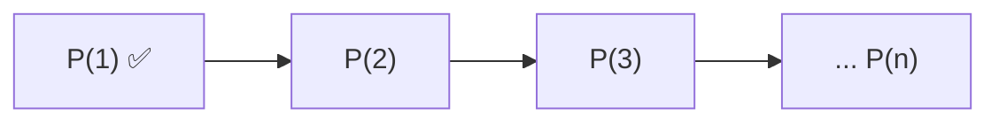

# 12. Indução matemática e recorrência

!!! info "Nesta aula"
    - O princípio da indução matemática.
    - Passo a passo de uma prova por indução.
    - Relações de recorrência.
    - Recursão em algoritmos e sua análise.

## 🪜 A ideia da indução

Provar algo para **todos** os naturais parece impossível — são infinitos! A
**indução matemática** resolve isso como uma escada:

1. **Caso base:** mostro que a propriedade vale para o primeiro degrau ($n = 1$ ou $0$).
2. **Passo indutivo:** assumo que vale para $n = k$ (**hipótese de indução**) e
   provo que vale para $n = k+1$.

Se consigo subir o primeiro degrau **e** sempre passar de um degrau ao seguinte,
alcanço **todos** os degraus.



## ✍️ Exemplo clássico

**Afirmação:** $1 + 2 + 3 + \dots + n = \dfrac{n(n+1)}{2}$.

=== "Caso base"
    Para $n = 1$: lado esquerdo $= 1$; lado direito $= \frac{1 \cdot 2}{2} = 1$. ✅

=== "Passo indutivo"
    **Hipótese:** vale para $n=k$, i.e. $\sum_{i=1}^{k} i = \frac{k(k+1)}{2}$.

    Para $n = k+1$:
    $$\sum_{i=1}^{k+1} i = \underbrace{\frac{k(k+1)}{2}}_{\text{hipótese}} + (k+1)
    = \frac{k(k+1) + 2(k+1)}{2} = \frac{(k+1)(k+2)}{2}$$

    Que é exatamente a fórmula com $n = k+1$. ∎

## 🔁 Relações de recorrência

Uma **recorrência** define um termo em função dos anteriores. Exemplos:

| Sequência | Recorrência | Caso base |
| :--- | :--- | :--- |
| Fatorial | $f(n) = n \cdot f(n-1)$ | $f(0) = 1$ |
| Fibonacci | $F(n) = F(n-1) + F(n-2)$ | $F(0)=0,\ F(1)=1$ |
| Potência de 2 | $a(n) = 2\, a(n-1)$ | $a(0) = 1$ |

## 🐍 Recorrência = recursão em código

A definição matemática vira função quase literalmente:

```python
def fatorial(n):
    if n == 0:            # caso base
        return 1
    return n * fatorial(n - 1)   # passo recursivo

def fib(n):
    if n < 2:
        return n
    return fib(n - 1) + fib(n - 2)

print(fatorial(5))   # 120
print([fib(i) for i in range(8)])   # [0, 1, 1, 2, 3, 5, 8, 13]
```

!!! warning "Recursão precisa de caso base!"
    Sem um caso base que **pare** a recursão, você cai em recursão infinita e
    estoura a pilha (`RecursionError`). Todo passo recursivo deve **aproximar** do
    caso base.

!!! tip "Indução ⇄ recursão"
    A prova por indução e a função recursiva são a **mesma ideia**: o caso base da
    indução é o caso base do código; o passo indutivo é a chamada recursiva. Provar
    por indução é essencialmente provar que seu algoritmo recursivo está correto.

## 🌍 Onde isso aparece

- **Correção de algoritmos:** provar que um algoritmo recursivo dá o resultado certo.
- **Análise de complexidade:** resolver recorrências (ex.: Merge Sort → $T(n) = 2T(n/2) + n$).
- **Estruturas recursivas:** árvores, listas, fractais.

## 📝 Exercícios

??? abstract "Exercício 1"
    Prove por indução que $1 + 3 + 5 + \dots + (2n-1) = n^2$.

??? abstract "Exercício 2"
    Escreva a recorrência da soma dos $n$ primeiros naturais e implemente-a
    recursivamente em Python.

??? abstract "Exercício 3"
    Prove por indução que $2^n > n$ para todo $n \ge 1$.

??? abstract "Exercício 4 — Desafio"
    A versão recursiva ingênua de `fib` é lenta. Implemente `fib_memo` com
    memoização (`dict` ou `functools.lru_cache`) e compare os tempos para `fib(35)`.

!!! tip "Próxima Parada 🚏 — Chegamos ao fim! 🎉"
    Feche o curso com a **[Lista 12 — Indução e recorrência](../listas/12-lista.md)**.
    Parabéns por percorrer toda a Matemática Computacional Aplicada — agora você
    tem as ferramentas para **modelar e provar** soluções computacionais!
